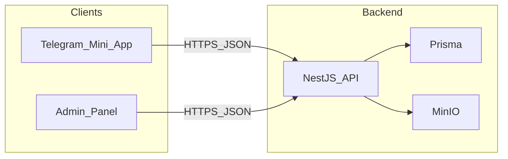

# Backend architecture — Parfumbox

The API is implemented as a **NestJS** application (`apps/api`) with **Prisma** for persistence and **MinIO** (S3-compatible) for object storage. This document outlines modules, auth, data model expectations, and API surface.

## High-level diagram

---

## NestJS modules (suggested)

| Module | Responsibility |
|--------|------------------|
| **Auth** | Validate Telegram Web App `initData` per [Telegram documentation](https://core.telegram.org/bots/webapp#validating-data-received-via-the-mini-app); create or resolve `User` by `telegramId`; issue **user** JWT scoped to that identity. |
| **AdminAuth** | Admin login (credentials from env or DB); issue **admin** JWT; separate guard from Telegram user routes. |
| **Users** | Admin: list/detail users. Self-service: `PATCH /users/me` for profile (phone, name, surname, birthday); `telegramUsername` may be read-only or synced from Telegram. |
| **Products** | CRUD for catalog; image handling via MinIO (presigned PUT or server-side upload). |
| **Orders** | Create from mini app (transactional: upsert contact, create order lines, optional stock decrement); list/filter/update status for admin. |
| **Upload / Storage** | Abstraction over MinIO: bucket, keys, URLs, presigned policy if used. |
| **Health** | Liveness/readiness for orchestration. |

Cross-cutting: global validation pipe, consistent error format, CORS configured for web and admin origins in non-production as needed.

---

## Authentication flows

### Telegram mini app

1. Client sends `initData` (raw string) to e.g. `POST /auth/telegram`.
2. Server validates HMAC signature using the bot token.
3. Server upserts `User` keyed by `telegramId` from the validated payload.
4. Server returns a short-lived JWT with claims sufficient for authorization (e.g. `sub` = user id or `telegramId`, standard expiry).

Protected routes use a **JWT guard** that resolves the user and attaches it to the request context.

### Admin

1. `POST /admin/auth/login` (or similar) with credentials.
2. Returns admin JWT; admin routes use a **separate guard** (and optionally role checks).

Admin and Telegram user tokens must not be interchangeable.

---

## Prisma / database (conceptual)

| Model | Notes |
|-------|--------|
| **User** | Unique `telegramId`; profile fields; `createdAt`; optional `role` or separate `AdminUser` table. |
| **Product** | Title, description, price; images as JSON array of URLs or a related table; optional `stock`. |
| **Order** | User relation; status enum; totals; timestamps; delivery/contact snapshot as needed. |
| **OrderItem** | Order relation; product reference and snapshot fields (price, title) for historical accuracy. |

**Orders**: Creating an order should run in a **transaction** when inventory is enforced: lock or update `Product.stock` rows and insert `Order` + `OrderItem` atomically.

---

## MinIO upload sequence

Typical options:

1. **Presigned PUT**: API returns a presigned URL and object key; client uploads directly to MinIO; API stores the final public or proxy URL on `Product`.
2. **Server upload**: Client sends multipart to API; API streams to MinIO; same URL storage.

Document the chosen approach in `DEVOPS.md` (bucket, region, public URL vs reverse proxy).

---

## API surface (illustrative)

- `POST /auth/telegram` — body: `{ initDataRaw: string }` → `{ accessToken, expiresIn, user }`.
- `GET /products`, `GET /products/:id` — public or authenticated per product policy.
- `POST /orders` — authenticated user; body: lines + profile/checkout fields.
- `GET /orders` — user’s orders; `GET /orders/:id` detail with status timeline data.
- `PATCH /users/me` — profile update.
- **Admin** (prefix e.g. `/admin`): products CRUD, orders list/patch status, users list, upload helpers, dashboard aggregates.

Exact paths and DTOs should be reflected in Swagger/OpenAPI if enabled.

---

## Errors and DTOs

- Use class-validator DTOs for all inputs.
- Return a **consistent error shape** (e.g. `message`, `statusCode`, `error` code) for client handling.
- Validate Telegram `initData` failure with 401; business rule failures with 4xx; unexpected failures with 5xx and logging.

---

## Summary

The backend centers on two auth domains (Telegram users vs admin), Prisma for relational data, MinIO for assets, and transactional order creation when inventory matters. Keep guards and token types strictly separated to avoid privilege confusion.
